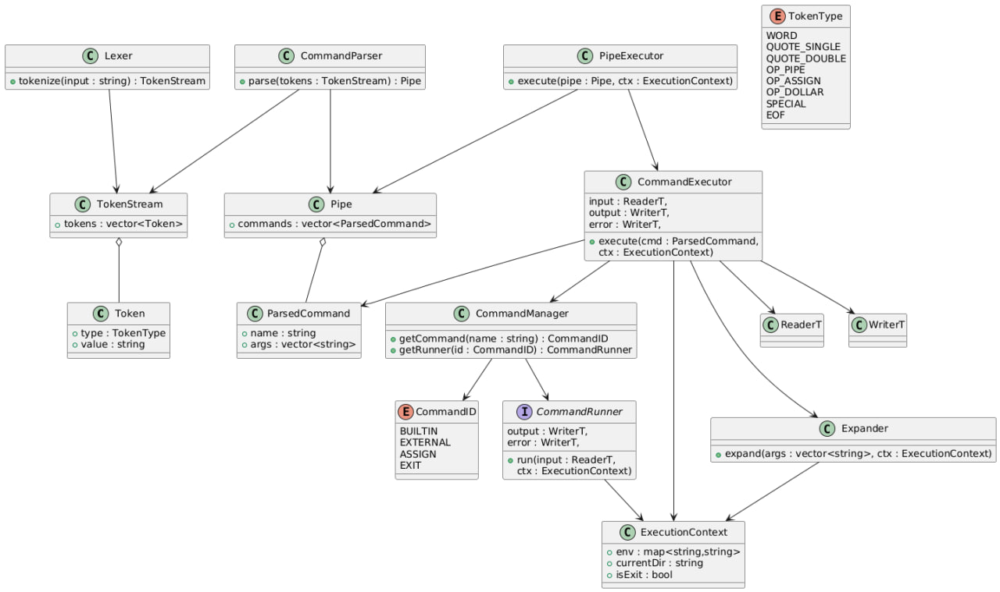

# Архитектурная документация

## Цель

Разработать расширяемый интерпретатор командной строки с поддержкой:

* встроенных команд;
* кавычек (quoting);
* переменных окружения;
* пайплайнов;
* внешних программ.

---

## Краткое описание архитектуры

### Основные модули

#### Lexer

* Разбивает входную строку на токены:

  * слова;
  * одиночные и двойные кавычки;
  * операторы (`|`, `=`, `$`);
  * специальные символы;
  * `EOF`.
* Учитывает правила quoting (full vs weak).
* Обрабатывает escape-последовательности.
* подставляет переменные окружения с помощью `expand`
* Результат работы: `TokenStream` (`std::vector<Token>`).

#### CommandParser

* Преобразует `TokenStream` в набор команд с аргументами.
* Запись в переменную окружения трактуется как отдельная команда.
* Возвращает `Pipe` (`std::vector<ParsedCommand>`).

#### PipeExecutor

* Последовательно обрабатывает команды пайплайна.
* Для каждой команды вызывает `CommandExecutor`.
* Перенаправляет потоки ввода, вывода и ошибок между командами.

#### ReaderT / WriterT

* Алиасы для:

  * `ReaderT` → `std::istream`;
  * `WriterT` → `std::ostream`.

#### CommandExecutor

* Получает реализацию команды из `CommandManager`.
* Выполняет одну команду в отдельном потоке.
* Обрабатывает ошибки выполнения.

#### CommandManager

* Связывает строковое имя команды с `enum`-идентификатором.
* По `enum` возвращает указатель на реализацию команды (`run`).

#### ExecutionContext

* Хранит глобальное состояние интерпретатора:

  * переменные окружения;
  * текущую директорию;
  * флаги завершения (например, `IsExit`).

---

## Main и хранилище состояния

* **main** — точка входа: инициализация окружения и контекста, цикл «ввод строки → Lexer → Parser → PipeExecutor», проверка флага выхода после каждого пайплайна.
* **Хранится** в одном глобальном `ExecutionContext`: переменные окружения, текущая директория, флаг `IsExit`, при необходимости последний код возврата (см. ниже). Локального контекста для пайплайна нет — контекст один и глобальный.

---

## Окружение и подстановка переменных

* **Окружение** хранится в `ExecutionContext` как отображение имя → значение (например, `std::map<std::string, std::string>` или аналог); при старте заполняется из `environ` (или аналога), далее изменяется командами присваивания.
* **Подстановка переменных окружения** выполняется в **Lexer**: имя команды и аргументы могут задаваться через переменные (например, `$PATH` в позиции команды), поэтому развёртывание `$VAR` делается на этапе лексирования, до разбора команд. Результат лексера — уже строки с подставленными значениями.

---

## Код возврата и exit

* **Нетривиальный код возврата** (например, ненулевой от внешней программы или от встроенной команды): сохраняется в `ExecutionContext` (например, поле `last_status`). Использование: вывод в stderr при желании, возможность учёта в условных конструкциях в будущем; на поведение пайплайна не влияет — следующая команда выполняется как обычно.
* **exit**: имеет код возврата (аргумент команды или 0 по умолчанию). При вызове в контексте устанавливается флаг `IsExit` и сохраняется целевой код возврата; пайплайн прерывается (оставшиеся команды не запускаются), main завершает цикл и возвращает сохранённый код в ОС.

---

## Пайплайн: процессы и контекст

* Команды пайплайна выполняются **последовательно**, каждая в **отдельном процессе**.
* Контекст для пайплайна **глобален** — один `ExecutionContext` на весь интерпретатор; локальных контекстов пайплайна не вводим.

---

## Выполнение команд

### Интерфейс команд

```cpp 
void expand(std::vector<std::string>&, ExecutinContext&)
```

* Выполняет подстановку переменных окружения.

```cpp
template <enum Command>
void run(ReaderT input, WriterT output, WriterT error);
```

* Реализация встроенных команд.
* Или вызов внешней программы.

---

## Принцип работы

1. Считывается входная строка пользователя.
2. `Lexer` преобразует строку в набор токенов.
    * подстановка переменных окружения с помощью `expand`
3. `CommandParser` преобразует токены в набор команд (`Pipe`).
4. `PipeExecutor` последовательно выполняет команды пайплайна через `CommandExecutor`.
5. `CommandExecutor`:
   * если команда реализована (включая присваивание), вызывает соответствующий `run<>`;
   * если команда не найдена — вызывает внешнюю команду `process`, передавая имя и аргументы.
6. Ошибки перехватываются и их сообщения записываются в поток ошибок.
7. Если была вызвана команда `exit`, в `ExecutionContext` устанавливается флаг `IsExit`.
8. После завершения пайплайна интерпретатор корректно завершает работу.

## UML-диаграмма архитектуры


