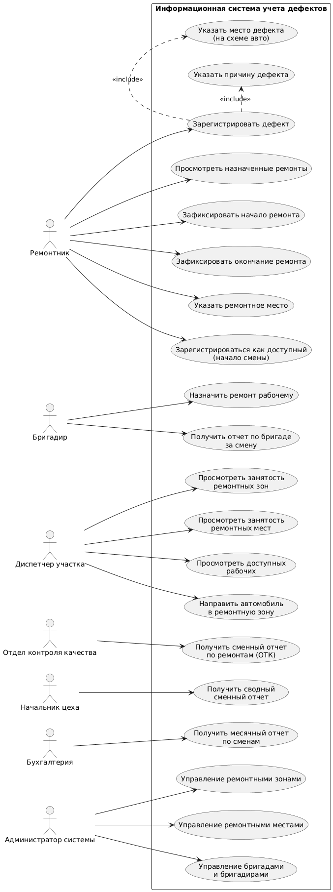
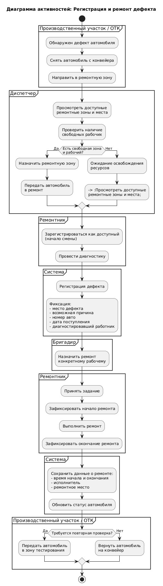
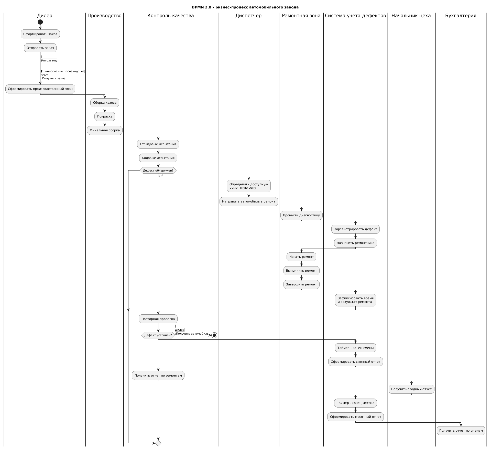
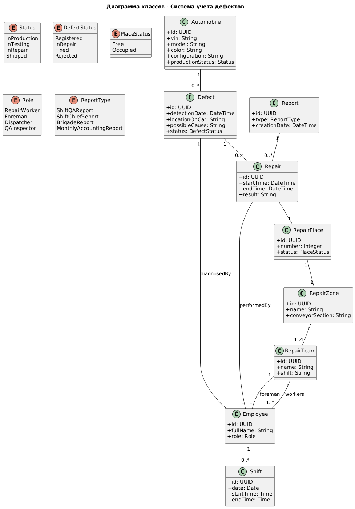
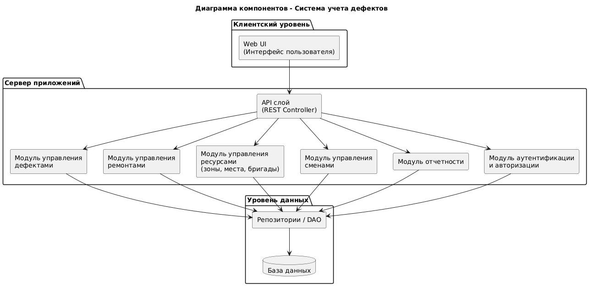
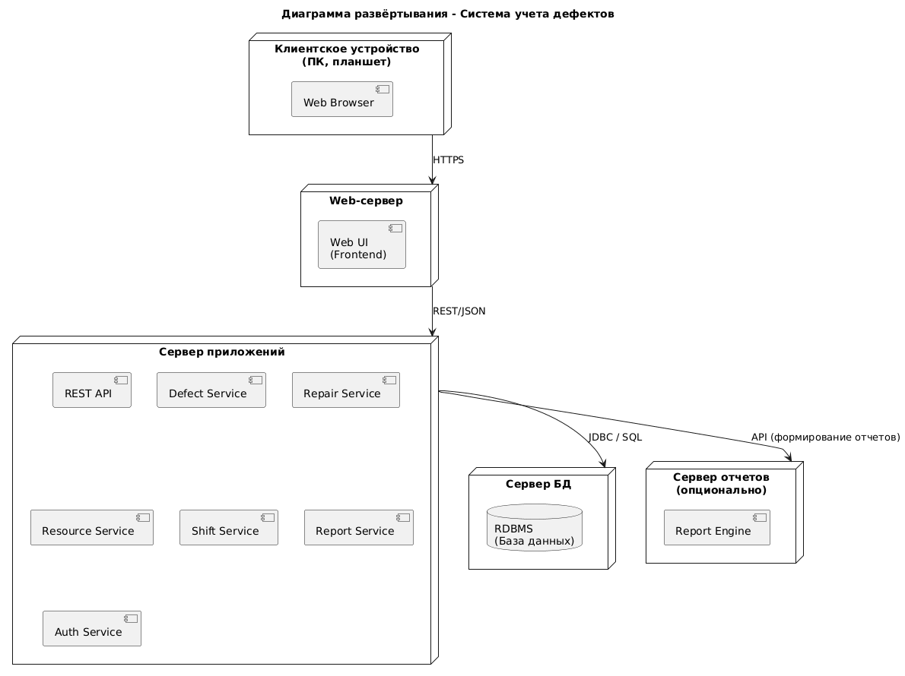
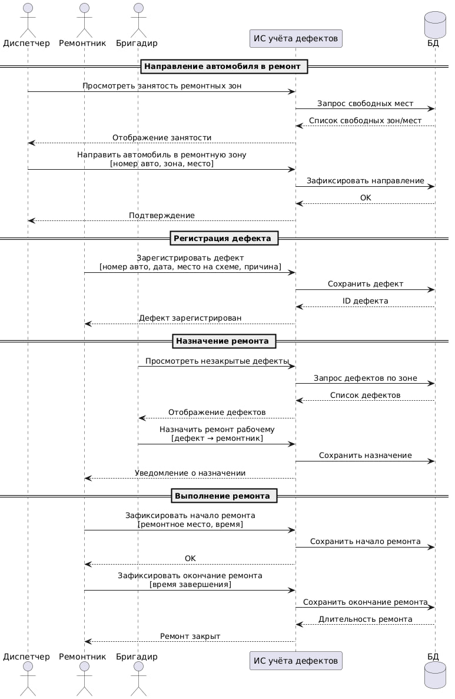
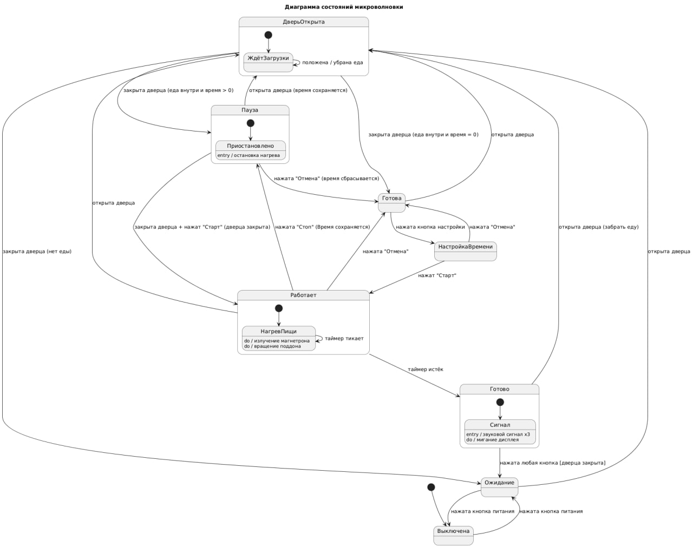
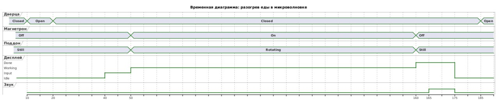

# Документация проекта

## 1. Диаграмма случаев использования

## 2. Диаграмма активностей

## 3. BPMN-диаграмма

## 4. Диаграмма классов

## 5. Диаграмма компонентов

## 6. Диаграмма развертывания

## 7. Диаграмма последовательностей

## 8. Диаграмма конечных автоматов (Микроволновка)

## 9. Временная диаграмма (Микроволновка)

